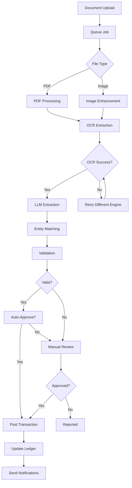

# Shop66 Ledger - AI Agents Architecture

## Overview

This document describes the AI-powered agents and automated workflows in the Shop66 Ledger system. These agents handle document processing, data extraction, validation, and intelligent matching to automate financial data entry and reduce manual work.

## Agent Types

### 1. OCR Agent
**Purpose**: Extract text from uploaded documents (PDFs, images)

**Responsibilities**:
- Receive uploaded documents from queue
- Pre-process images (rotation, enhancement, contrast)
- Execute OCR using configured engine
- Store extracted text and metadata
- Handle multi-page documents
- Detect document language

**Inputs**:
- Document file (PDF/JPG/PNG)
- Document ID
- OCR engine preference

**Outputs**:
- Plain text extraction
- Positional coordinates (if available)
- Confidence scores
- Page-by-page breakdown
- Processing metrics

**Error Handling**:
- Retry with different engines on failure
- Fall back to local Tesseract
- Mark as manual review if all fail

### 2. Document Parser Agent
**Purpose**: Structure raw OCR text into meaningful data

**Responsibilities**:
- Analyze document layout
- Identify document type (invoice/receipt/credit note)
- Extract header information
- Parse line items
- Identify totals and taxes
- Detect currency and dates

**Inputs**:
- OCR text
- Document metadata
- Parsing rules

**Outputs**:
```json
{
  "document_type": "invoice",
  "header": {
    "vendor_name": "string",
    "vendor_tax_id": "string",
    "document_number": "string",
    "date": "YYYY-MM-DD",
    "due_date": "YYYY-MM-DD"
  },
  "lines": [...],
  "totals": {
    "subtotal": 0.00,
    "tax": 0.00,
    "total": 0.00
  }
}
```

### 3. LLM Extraction Agent
**Purpose**: Use Large Language Models for intelligent data extraction

**Responsibilities**:
- Construct structured prompts
- Send OCR text to LLM API
- Parse JSON responses
- Validate response schema
- Handle token limits
- Implement retry logic

**Prompt Template**:
```
You are a financial document processor. Extract the following information from this document:

[OCR TEXT]

Return a JSON object with this exact structure:
{
  "vendor": {...},
  "document": {...},
  "lines": [...],
  "totals": {...}
}

Rules:
1. All amounts must be numbers
2. Dates must be YYYY-MM-DD format
3. If information is missing, use null
4. Calculate line totals if not present
```

**Configuration**:
```php
[
    'model' => 'gpt-4-turbo',
    'temperature' => 0.1,
    'max_tokens' => 2000,
    'response_format' => 'json_object',
    'timeout' => 30
]
```

### 4. Entity Matcher Agent
**Purpose**: Match extracted data to existing database entities

**Responsibilities**:
- Vendor matching by tax ID
- Vendor fuzzy matching by name
- Item catalog matching
- Category suggestion
- Account mapping
- Store assignment

**Matching Algorithms**:
```php
// Vendor Matching
1. Exact tax_id match (confidence: 100%)
2. Normalized name match (confidence: 90%)
3. Trigram similarity > 0.8 (confidence: 70%)
4. Partial name match (confidence: 50%)

// Item Matching
1. Exact SKU match (confidence: 100%)
2. Exact name match (confidence: 95%)
3. Fuzzy name match > 0.85 (confidence: 75%)
4. Category + partial match (confidence: 60%)
```

**Output**:
```json
{
  "vendor": {
    "matched_id": 123,
    "confidence": 95,
    "method": "tax_id"
  },
  "items": [
    {
      "line": 1,
      "matched_id": 456,
      "confidence": 85,
      "method": "fuzzy_name"
    }
  ],
  "suggested_category_id": 789,
  "suggested_store_id": 1
}
```

### 5. Validation Agent
**Purpose**: Validate extracted and matched data

**Responsibilities**:
- Arithmetic validation
- Tax calculation verification
- Date logic validation
- Duplicate detection
- Compliance checks
- Business rule validation

**Validation Rules**:
```php
// Arithmetic
sum(line_totals) == subtotal ± 0.01
subtotal + tax == total ± 0.01
tax == subtotal * tax_rate ± 0.01

// Dates
document_date <= today()
due_date >= document_date
document_date reasonable (not 1900 or 2099)

// Duplicates
hash(vendor_id + date + total + doc_number) not exists

// Business Rules
total > 0
vendor exists or can be created
at least one line item
currency is valid
```

**Confidence Scoring**:
```php
$confidence = 100;
$confidence -= 10 if arithmetic mismatch
$confidence -= 20 if vendor not matched
$confidence -= 5 per unmatched item
$confidence -= 15 if duplicate suspected
$confidence -= 10 if dates invalid

if ($confidence < 60) {
    $status = 'manual_review_required';
}
```

### 6. Notification Agent
**Purpose**: Send notifications about document processing status

**Responsibilities**:
- Queue status notifications
- Send review requests
- Alert on errors
- Batch notifications
- Track delivery status

**Notification Types**:
```php
[
    'document.uploaded' => 'Your document has been uploaded',
    'document.processing' => 'Processing your document...',
    'document.extracted' => 'Data extracted, review required',
    'document.review_needed' => 'Document needs your review',
    'document.approved' => 'Document approved and posted',
    'document.rejected' => 'Document rejected: {reason}',
    'document.error' => 'Error processing document'
]
```

### 7. Reconciliation Agent
**Purpose**: Match bank transactions with system records

**Responsibilities**:
- Import bank statements
- Parse transaction data
- Match by amount and date
- Suggest vendor matches
- Identify missing transactions
- Flag discrepancies

**Matching Strategy**:
```php
// Perfect Match
amount == transaction.total
&& date == transaction.date
&& vendor_reference matches

// Probable Match (>80% confidence)
amount == transaction.total
&& date within 3 days
&& vendor similar

// Possible Match (>60% confidence)
amount == transaction.total ± 0.10
&& date within 7 days

// No Match
Create unreconciled entry
```

## Queue Architecture

### Queue Configuration

```php
// config/queue.php
'connections' => [
    'documents' => [
        'driver' => 'redis',
        'queue' => 'documents',
        'retry_after' => 300,
        'block_for' => null,
    ],
    'ocr' => [
        'driver' => 'redis',
        'queue' => 'ocr-processing',
        'retry_after' => 600,
    ],
    'extraction' => [
        'driver' => 'redis',
        'queue' => 'ai-extraction',
        'retry_after' => 180,
    ],
    'notifications' => [
        'driver' => 'redis',
        'queue' => 'notifications',
        'retry_after' => 60,
    ]
]
```

### Job Pipeline

```php
// Document Processing Pipeline
DocumentUploadedJob::dispatch($document)
    ->chain([
        new PrepareDocumentJob($document),
        new OCRDocumentJob($document),
        new ExtractDataJob($document),
        new MatchEntitiesJob($document),
        new ValidateDocumentJob($document),
        new NotifyReviewersJob($document)
    ])
    ->onQueue('documents')
    ->catch(function ($exception) {
        // Handle pipeline failure
    });
```

### Job Classes

```php
class OCRDocumentJob implements ShouldQueue
{
    use Dispatchable, InteractsWithQueue, Queueable, SerializesModels;

    public $tries = 3;
    public $backoff = [60, 180, 300];
    public $timeout = 120;

    public function handle(OCRService $ocrService)
    {
        $text = $ocrService->extract($this->document);

        DocumentIngestion::create([
            'document_id' => $this->document->id,
            'ocr_text' => $text,
            'ocr_engine' => $ocrService->getEngine(),
            'status' => 'completed'
        ]);

        $this->document->update(['status' => 'extracted']);
    }

    public function failed($exception)
    {
        $this->document->update(['status' => 'ocr_failed']);
        Log::error('OCR failed', ['document' => $this->document->id]);
    }
}
```

## Service Architecture

### OCR Service

```php
interface OCREngineInterface
{
    public function extract(string $filePath): OCRResult;
    public function supports(string $mimeType): bool;
}

class OCRService
{
    protected array $engines = [
        'textract' => TextractEngine::class,
        'vision' => GoogleVisionEngine::class,
        'tesseract' => TesseractEngine::class,
    ];

    public function extract(Document $document): string
    {
        $engine = $this->selectEngine($document);

        try {
            $result = $engine->extract($document->file_path);
            $this->logSuccess($document, $engine, $result);
            return $result->text;
        } catch (Exception $e) {
            return $this->fallbackExtraction($document);
        }
    }
}
```

### LLM Service

```php
class LLMExtractionService
{
    protected $client;
    protected $config;

    public function extract(string $text): array
    {
        $prompt = $this->buildPrompt($text);

        $response = $this->client->chat()->create([
            'model' => $this->config['model'],
            'messages' => [
                ['role' => 'system', 'content' => $this->getSystemPrompt()],
                ['role' => 'user', 'content' => $prompt]
            ],
            'temperature' => 0.1,
            'response_format' => ['type' => 'json_object']
        ]);

        return $this->parseResponse($response);
    }

    protected function getSystemPrompt(): string
    {
        return "You are a financial document processor.
                Extract structured data from documents.
                Always return valid JSON.
                Be precise with numbers and dates.";
    }
}
```

### Matching Service

```php
class EntityMatchingService
{
    public function matchVendor(array $vendorData): ?MatchResult
    {
        // Try exact tax ID match
        if ($vendorData['tax_id']) {
            $vendor = Vendor::where('tax_id', $vendorData['tax_id'])->first();
            if ($vendor) {
                return new MatchResult($vendor, 100, 'tax_id');
            }
        }

        // Try fuzzy name match
        $candidates = $this->fuzzySearch($vendorData['name']);

        foreach ($candidates as $candidate) {
            $similarity = $this->calculateSimilarity(
                $vendorData['name'],
                $candidate->name
            );

            if ($similarity > 0.8) {
                return new MatchResult($candidate, $similarity * 100, 'fuzzy');
            }
        }

        return null;
    }

    protected function calculateSimilarity(string $a, string $b): float
    {
        // Implement trigram similarity
        $a = strtolower(trim($a));
        $b = strtolower(trim($b));

        similar_text($a, $b, $percent);
        return $percent / 100;
    }
}
```

## Workflow Orchestration

### Document Processing Flow



### State Machine

```php
class DocumentStateMachine
{
    protected array $states = [
        'uploaded' => ['processing'],
        'processing' => ['extracting', 'failed'],
        'extracting' => ['extracted', 'extraction_failed'],
        'extracted' => ['matching', 'review'],
        'matching' => ['matched', 'review'],
        'matched' => ['validating'],
        'validating' => ['valid', 'review'],
        'valid' => ['approved', 'review'],
        'review' => ['approved', 'rejected'],
        'approved' => ['posting'],
        'posting' => ['posted'],
        'posted' => [],
        'rejected' => ['uploaded'],
        'failed' => ['uploaded']
    ];

    public function transition(Document $document, string $toState): bool
    {
        $fromState = $document->status;

        if (!$this->canTransition($fromState, $toState)) {
            throw new InvalidStateTransition(
                "Cannot transition from {$fromState} to {$toState}"
            );
        }

        $document->update(['status' => $toState]);

        event(new DocumentStateChanged($document, $fromState, $toState));

        return true;
    }
}
```

## Configuration

### Agent Configuration

```php
// config/agents.php
return [
    'ocr' => [
        'default_engine' => env('OCR_ENGINE', 'textract'),
        'engines' => [
            'textract' => [
                'region' => env('AWS_DEFAULT_REGION'),
                'version' => 'latest',
                'timeout' => 30,
            ],
            'vision' => [
                'key_file' => env('GOOGLE_VISION_KEY_FILE'),
                'project_id' => env('GOOGLE_PROJECT_ID'),
            ],
            'tesseract' => [
                'binary' => '/usr/bin/tesseract',
                'lang' => 'eng',
            ],
        ],
        'retry_attempts' => 3,
        'retry_delay' => 60,
    ],

    'llm' => [
        'provider' => env('LLM_PROVIDER', 'openai'),
        'providers' => [
            'openai' => [
                'api_key' => env('OPENAI_API_KEY'),
                'model' => 'gpt-4-turbo-preview',
                'max_tokens' => 2000,
                'temperature' => 0.1,
            ],
            'anthropic' => [
                'api_key' => env('ANTHROPIC_API_KEY'),
                'model' => 'claude-3-opus',
                'max_tokens' => 2000,
            ],
        ],
        'cache_ttl' => 3600,
        'rate_limit' => 100,
    ],

    'matching' => [
        'vendor' => [
            'exact_match_confidence' => 100,
            'fuzzy_match_threshold' => 0.8,
            'fuzzy_match_confidence' => 75,
            'partial_match_confidence' => 50,
        ],
        'item' => [
            'sku_match_confidence' => 100,
            'name_match_confidence' => 90,
            'fuzzy_threshold' => 0.85,
        ],
    ],

    'validation' => [
        'arithmetic_tolerance' => 0.01,
        'date_range_days' => 365,
        'min_confidence_auto_approve' => 95,
        'min_confidence_review' => 60,
    ],

    'notifications' => [
        'channels' => ['database', 'mail'],
        'batch_size' => 100,
        'batch_delay' => 300,
    ],
];
```

## Monitoring & Observability

### Metrics

```php
class AgentMetrics
{
    public function recordOCR(Document $document, $duration, $success)
    {
        Metric::create([
            'type' => 'ocr_processing',
            'document_id' => $document->id,
            'duration_ms' => $duration,
            'success' => $success,
            'engine' => $document->ingestion->ocr_engine,
        ]);
    }

    public function recordExtraction($document, $tokens, $confidence)
    {
        Metric::create([
            'type' => 'llm_extraction',
            'document_id' => $document->id,
            'tokens_used' => $tokens,
            'confidence_score' => $confidence,
            'model' => config('agents.llm.provider'),
        ]);
    }

    public function getStats(string $type, Carbon $from, Carbon $to)
    {
        return Metric::where('type', $type)
            ->whereBetween('created_at', [$from, $to])
            ->selectRaw('
                COUNT(*) as total,
                AVG(duration_ms) as avg_duration,
                SUM(success) / COUNT(*) * 100 as success_rate,
                AVG(confidence_score) as avg_confidence
            ')
            ->first();
    }
}
```

### Logging

```php
class AgentLogger
{
    public function logProcessing($agent, $document, $context = [])
    {
        Log::channel('agents')->info("Agent processing", [
            'agent' => $agent,
            'document_id' => $document->id,
            'status' => $document->status,
            'context' => $context,
        ]);
    }

    public function logError($agent, $exception, $document = null)
    {
        Log::channel('agents')->error("Agent error", [
            'agent' => $agent,
            'error' => $exception->getMessage(),
            'trace' => $exception->getTraceAsString(),
            'document_id' => $document?->id,
        ]);

        // Send to error tracking
        if (app()->bound('sentry')) {
            app('sentry')->captureException($exception);
        }
    }
}
```

### Health Checks

```php
class AgentHealthCheck
{
    public function check(): array
    {
        return [
            'ocr' => $this->checkOCR(),
            'llm' => $this->checkLLM(),
            'queues' => $this->checkQueues(),
            'storage' => $this->checkStorage(),
        ];
    }

    protected function checkOCR(): array
    {
        try {
            $testFile = storage_path('app/test/sample.pdf');
            $result = app(OCRService::class)->test($testFile);

            return [
                'status' => 'healthy',
                'response_time' => $result['duration'],
            ];
        } catch (Exception $e) {
            return [
                'status' => 'unhealthy',
                'error' => $e->getMessage(),
            ];
        }
    }

    protected function checkQueues(): array
    {
        $queues = ['documents', 'ocr', 'extraction', 'notifications'];
        $status = [];

        foreach ($queues as $queue) {
            $size = Redis::llen("queues:{$queue}");
            $status[$queue] = [
                'size' => $size,
                'status' => $size < 1000 ? 'healthy' : 'warning',
            ];
        }

        return $status;
    }
}
```

## Performance Optimization

### Caching Strategy

```php
class AgentCache
{
    // Cache OCR results for identical files
    public function getOCR(string $fileHash): ?string
    {
        return Cache::tags(['ocr'])->get("ocr:{$fileHash}");
    }

    public function setOCR(string $fileHash, string $text): void
    {
        Cache::tags(['ocr'])->put(
            "ocr:{$fileHash}",
            $text,
            now()->addDays(7)
        );
    }

    // Cache LLM extractions
    public function getExtraction(string $textHash): ?array
    {
        return Cache::tags(['extraction'])->get("extract:{$textHash}");
    }

    // Cache entity matches
    public function getVendorMatch(string $query): ?int
    {
        return Cache::tags(['vendors'])->get("vendor:{$query}");
    }
}
```

### Batch Processing

```php
class BatchProcessor
{
    public function processBatch(Collection $documents): void
    {
        $documents->chunk(10)->each(function ($chunk) {
            $jobs = $chunk->map(function ($document) {
                return new ProcessDocumentJob($document);
            });

            Bus::batch($jobs)
                ->name('Document Batch ' . now())
                ->onQueue('documents')
                ->dispatch();
        });
    }
}
```

## Error Handling

### Retry Strategies

```php
class RetryableAgent
{
    protected $maxAttempts = 3;
    protected $retryDelay = [60, 180, 300]; // seconds

    public function executeWithRetry(callable $operation)
    {
        $attempt = 0;
        $lastException = null;

        while ($attempt < $this->maxAttempts) {
            try {
                return $operation();
            } catch (Exception $e) {
                $lastException = $e;
                $attempt++;

                if ($attempt < $this->maxAttempts) {
                    $delay = $this->retryDelay[$attempt - 1] ?? 60;
                    sleep($delay);
                }
            }
        }

        throw new MaxRetriesExceededException(
            "Operation failed after {$attempt} attempts",
            0,
            $lastException
        );
    }
}
```

### Fallback Mechanisms

```php
class FallbackHandler
{
    public function handleOCRFailure(Document $document): void
    {
        // Try alternative OCR engine
        $engines = ['textract', 'vision', 'tesseract'];

        foreach ($engines as $engine) {
            try {
                $text = $this->tryEngine($engine, $document);
                if ($text) return;
            } catch (Exception $e) {
                continue;
            }
        }

        // All engines failed, mark for manual entry
        $document->update(['status' => 'manual_entry_required']);

        Notification::send(
            $document->creator,
            new ManualEntryRequired($document)
        );
    }
}
```

## Testing

### Unit Tests

```php
class OCRAgentTest extends TestCase
{
    public function test_extracts_text_from_pdf()
    {
        $document = Document::factory()->pdf()->create();
        $agent = new OCRAgent($document);

        $result = $agent->process();

        $this->assertNotEmpty($result->text);
        $this->assertGreaterThan(0, $result->confidence);
    }

    public function test_handles_ocr_failure()
    {
        $document = Document::factory()->corrupted()->create();
        $agent = new OCRAgent($document);

        $this->expectException(OCRException::class);

        $agent->process();
    }
}
```

### Integration Tests

```php
class DocumentPipelineTest extends TestCase
{
    public function test_complete_document_pipeline()
    {
        // Upload document
        $response = $this->postJson('/api/documents', [
            'file' => UploadedFile::fake()->create('invoice.pdf'),
            'store_id' => 1,
        ]);

        $document = Document::find($response->json('id'));

        // Process through pipeline
        $this->artisan('queue:work --stop-when-empty');

        // Assert final state
        $document->refresh();
        $this->assertEquals('posted', $document->status);
        $this->assertNotNull($document->transaction_id);
    }
}
```

## Deployment

### Docker Configuration

```dockerfile
# Worker container for agents
FROM php:8.3-cli

RUN apt-get update && apt-get install -y \
    tesseract-ocr \
    poppler-utils \
    imagemagick

COPY . /app
WORKDIR /app

CMD ["php", "artisan", "queue:work", "--queue=documents,ocr,extraction"]
```

### Scaling Configuration

```yaml
# kubernetes/agents-deployment.yaml
apiVersion: apps/v1
kind: Deployment
metadata:
  name: document-agents
spec:
  replicas: 3
  template:
    spec:
      containers:
      - name: agent-worker
        image: shop66-agents:latest
        resources:
          requests:
            memory: "512Mi"
            cpu: "500m"
          limits:
            memory: "1Gi"
            cpu: "1000m"
```

## Maintenance

### Regular Tasks

1. **Daily**
   - Monitor queue sizes
   - Check error rates
   - Review failed jobs

2. **Weekly**
   - Analyze extraction accuracy
   - Update vendor matching database
   - Clear processed document cache

3. **Monthly**
   - Review LLM token usage
   - Update OCR models
   - Performance optimization
   - Cost analysis

### Troubleshooting Guide

| Issue | Possible Cause | Solution |
|-------|---------------|----------|
| High OCR failure rate | Poor image quality | Enable image enhancement |
| Low extraction accuracy | Model drift | Retrain or update prompts |
| Slow processing | Queue backlog | Scale workers |
| High costs | Excessive LLM calls | Implement caching |
| Duplicate transactions | Hash collision | Improve duplicate detection |

---

*Last Updated: December 2024*
*Version: 1.0*
*Status: Architecture Design*